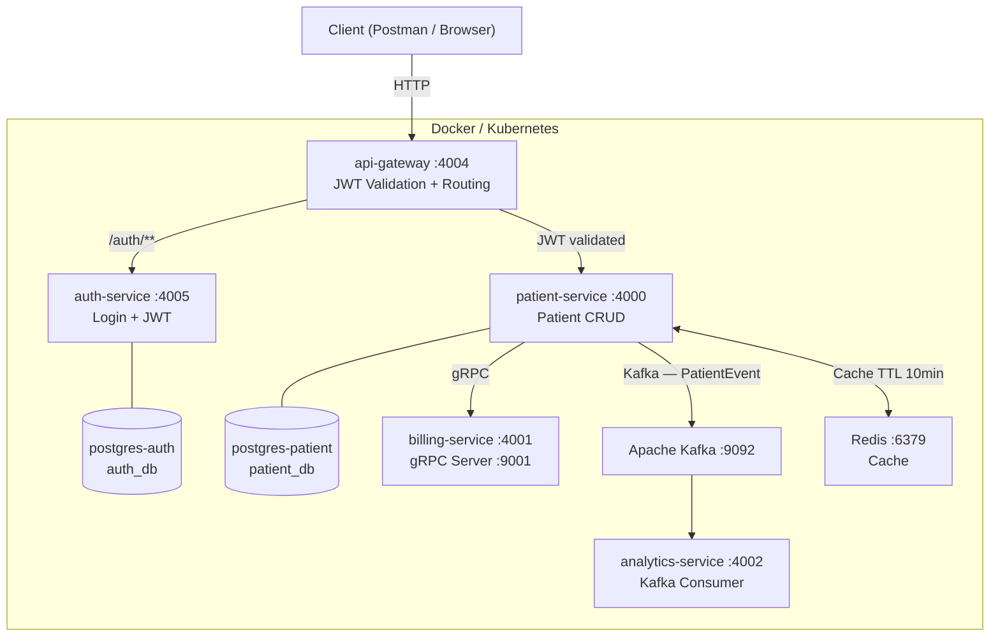

# Distributed Microservice Backend Platform

A backend system built with a microservices architecture to demonstrate real-world distributed systems patterns — service communication via REST, gRPC, and Kafka, JWT-based authentication, Redis caching, and deployment on Docker and Kubernetes.

> **Practice project** — built for learning and portfolio purposes. Not a production product.

[](https://openjdk.org/projects/jdk/21/)
[](https://spring.io/projects/spring-boot)
[](https://www.docker.com/)
[](https://kubernetes.io/)
[](https://kafka.apache.org/)
[](https://redis.io/)
[](https://www.postgresql.org/)
[](https://github.com/features/actions)

---

## Table of Contents

- [Overview](#overview)
- [Architecture](#architecture)
- [Tech Stack](#tech-stack)
- [Services](#services)
- [How to Run](#how-to-run)
  - [Option A — Docker](#option-a--docker)
  - [Option B — Kubernetes](#option-b--kubernetes)
- [API Reference](#api-reference)
- [Project Structure](#project-structure)

---

## Overview

> 🎓 **This is a practice project** — built purely for learning and portfolio purposes. It has no real users, no production deployment, and no live data. The patient management domain is just a vehicle to implement and demonstrate backend engineering concepts.

**What this project demonstrates:**

| Concept | Implementation |
|---|---|
| Microservices architecture | 5 independently deployable Spring Boot services |
| Synchronous inter-service communication | REST (HTTP/JSON) between gateway and services |
| Binary RPC | gRPC + Protobuf between patient-service and billing-service |
| Async event streaming | Apache Kafka (Protobuf events) from patient-service to analytics-service |
| API security | JWT authentication enforced at the gateway layer (not in individual services) |
| Caching | Redis with TTL-based cache and automatic eviction on mutation |
| Containerization | Docker — one image per service, environment-driven config |
| Container orchestration | Kubernetes — StatefulSets, health probes, resource limits, rolling updates |
| CI pipeline | GitHub Actions — builds and tests all services on every push |


---


## Architecture

### System Diagram



### Communication Patterns

| Pattern | Between | Protocol | Format |
|---|---|---|---|
| REST | Client → Gateway → Services | HTTP/1.1 | JSON |
| Reactive WebClient | Gateway → auth-service `/validate` | HTTP non-blocking | Bearer header |
| **gRPC** | patient-service → billing-service | HTTP/2 | Protobuf |
| **Kafka** | patient-service → analytics-service | Async message | Protobuf |
| **Redis** | patient-service ↔ cache | Redis protocol | JSON |

### Request Flow — Create Patient

```
POST /api/patients/create-patient  (Authorization: Bearer <token>)
  → api-gateway
      → JwtValidationFilter → auth-service /validate → 200 OK
      → patient-service
          ├── Save to PostgreSQL
          ├── gRPC → billing-service → CreateBillingAccount   (sync)
          └── Kafka → topic:"patient" → analytics-service     (async)
```

---

## Tech Stack

| | Technology | Purpose |
|---|---|---|
| **Language** | Java 21 | All services |
| **Framework** | Spring Boot 4, Spring Cloud Gateway | Service logic + gateway |
| **Auth** | JWT (HS512) | Stateless authentication |
| **Databases** | PostgreSQL 15 (x2) | Auth DB + Patient DB |
| **Cache** | Redis 7 | Patient read cache, TTL 10 min |
| **Messaging** | Apache Kafka 3.7 (KRaft) | Async event streaming |
| **RPC** | gRPC + Protobuf | Billing service calls |
| **Containers** | Docker | Per-service images |
| **Orchestration** | Kubernetes (Docker Desktop) | Full K8s deployment |
| **CI** | GitHub Actions | Build + test on every push |
| **Build** | Maven | Per-service build tool |

---

## Services

| Service | Port | Role |
|---|---|---|
| `api-gateway` | `4004` (K8s: `30400`) | Entry point — routes requests, validates JWT |
| `auth-service` | `4005` | Issues and validates JWT tokens |
| `patient-service` | `4000` | Patient CRUD — orchestrates gRPC + Kafka |
| `billing-service` | `4001` / gRPC `9001` | Creates billing account on patient creation |
| `analytics-service` | `4002` | Consumes Kafka events, logs patient activity |
| `postgres-auth` | `5432` | Database for auth-service (`auth_db`) |
| `postgres-patient` | `5432` | Database for patient-service (`patient_db`) |
| `redis` | `6379` | In-memory cache for patient data |
| `kafka` | `9092` | Event broker (KRaft mode — no Zookeeper) |

---

## How to Run

### Prerequisites

- **Docker Desktop** — with Docker or Kubernetes enabled
- **Java 21 + Maven** — only needed to build images locally

---

### Option A — Docker

#### 1. Build service images

```bash
docker build -t auth-service:latest      ./auth-service
docker build -t patient-service:latest   ./patient-service
docker build -t billing-service:latest   ./billing-service
docker build -t analytics-service:latest ./analytics-service
docker build -t api-gateway:latest       ./api-gateway
```

#### 2. Start infrastructure

```bash
# Auth DB
docker run -d --name auth-service-db \
  -e POSTGRES_DB=auth_db -e POSTGRES_USER=postgres -e POSTGRES_PASSWORD=admin \
  postgres:15

# Patient DB
docker run -d --name patient-service-db \
  -e POSTGRES_DB=patient_db -e POSTGRES_USER=postgres -e POSTGRES_PASSWORD=admin \
  postgres:15

# Redis
docker run -d --name redis -p 6379:6379 redis:alpine

# Kafka (KRaft — no Zookeeper)
docker run -d --name kafka -p 9092:9092 \
  -e KAFKA_NODE_ID=1 -e KAFKA_PROCESS_ROLES=broker,controller \
  -e KAFKA_LISTENERS=PLAINTEXT://:9092,CONTROLLER://:9093 \
  -e KAFKA_ADVERTISED_LISTENERS=PLAINTEXT://kafka:9092 \
  -e KAFKA_CONTROLLER_QUORUM_VOTERS=1@kafka:9093 \
  -e CLUSTER_ID=MkU3OEVBNTcwNTJENDM2Qk \
  apache/kafka:3.7.0
```

#### 3. Key environment variables

| Service | Variable | Value |
|---|---|---|
| `auth-service` | `JWT_SECRET` | Any 64+ char string |
| `auth-service` | `SPRING_DATASOURCE_URL` | `jdbc:postgresql://auth-service-db:5432/auth_db` |
| `api-gateway` | `AUTH_SERVICE_URL` | `http://auth-service:4005` |
| `patient-service` | `SPRING_KAFKA_BOOTSTRAP_SERVERS` | `kafka:9092` |
| `patient-service` | `BILLING_SERVICE_ADDRESS` | `billing-service` |

Access the API at: `http://localhost:4004`

---

### Option B — Kubernetes

Requires Docker Desktop with **Kubernetes enabled**
*(Docker Desktop → Settings → Kubernetes → Enable Kubernetes)*

#### 1. Build images

```bash
docker build -t auth-service:latest      ./auth-service
docker build -t patient-service:latest   ./patient-service
docker build -t billing-service:latest   ./billing-service
docker build -t analytics-service:latest ./analytics-service
docker build -t api-gateway:latest       ./api-gateway
```

#### 2. Deploy

```bash
kubectl apply -f k8s/namespace.yaml
kubectl apply -f k8s/secrets.yaml
kubectl apply -f k8s/configmaps.yaml
kubectl apply -f k8s/infrastructure/
kubectl apply -f k8s/services/
```

#### 3. Verify pods are running

```bash
kubectl get pods -n patient-management
```

> Spring Boot services take 60–120 seconds to fully start. The `startupProbe` ensures no traffic is routed until the JVM is ready.

Access the API at: `http://localhost:30400`

#### Useful commands

```bash
# Watch pods
kubectl get pods -n patient-management -w

# Tail logs
kubectl logs -l app=patient-service -n patient-management -f

# Scale a service
kubectl scale deployment patient-service --replicas=2 -n patient-management

# Rolling update + rollback
kubectl set image deployment/patient-service patient-service=patient-service:v2 -n patient-management
kubectl rollout undo deployment/patient-service -n patient-management
kubectl rollout history deployment/patient-service -n patient-management
```

---

## API Reference

> **Postman collection:** [`postman_collection.json`](./postman_collection.json) — import into Postman to test all endpoints.
>
> Set environment variable `domain`:
> - Docker: `http://localhost:4004/api`
> - Kubernetes: `http://localhost:30400/api`

---

### `POST /auth/login`

**No auth required.** Returns a JWT token.

```json
// Request
{ "email": "testuser@test.com", "password": "password123" }

// Response 200
{ "token": "eyJhbGciOiJIUzUxMiJ9..." }
```

---

> All endpoints below require: `Authorization: Bearer <token>`

---

### `GET /api/patients/get-patients`

Returns all patients. Cache-backed via Redis.

```json
// Response 200
[
  {
    "id": "5d25ed71-324b-4bd3-bf90-586d6ebd9fbd",
    "name": "Joshi Rahul",
    "email": "joshi@example.com",
    "address": "Mumbai, Maharashtra",
    "dateOfBirth": "1990-05-15",
    "registeredDate": "2023-04-01"
  }
]
```

---

### `POST /api/patients/create-patient`

Creates a patient. Triggers gRPC call to `billing-service` and Kafka event to `analytics-service`.

```json
// Request
{
  "name": "Joshi Rahul",
  "email": "joshi@example.com",
  "address": "1234 Elm St, Springfield",
  "dateOfBirth": "1990-05-15",
  "registeredDate": "2023-04-01"
}

// Response 201
{ "id": "5d25ed71-...", "name": "Joshi Rahul", "email": "joshi@example.com" }
```

---

### `PUT /api/patients/update-patient/{id}`

Updates patient details. Evicts their Redis cache entry.

```json
// Request (same fields as create, registeredDate not required)
{ "name": "Joshi Rahul Updated", "email": "joshi@example.com", "address": "...", "dateOfBirth": "1990-05-15" }
```

---

### `DELETE /api/patients/delete-patient/{id}`

Deletes patient. Evicts cache. Returns `204 No Content`.

---

## Project Structure

```
.
├── api-gateway/              Spring Cloud Gateway — routing + JWT filter
├── auth-service/             Login + JWT issuance/validation
├── patient-service/          Patient CRUD + gRPC client + Kafka producer + Redis cache
├── billing-service/          gRPC server (CreateBillingAccount)
├── analytics-service/        Kafka consumer (PatientEvent)
├── integration-tests/        RestAssured end-to-end tests
├── k8s/
│   ├── namespace.yaml
│   ├── secrets.yaml
│   ├── configmaps.yaml
│   ├── infrastructure/       postgres (x2), redis, kafka
│   └── services/             all Spring Boot service deployments
├── .github/workflows/        GitHub Actions CI pipeline
├── postman_collection.json   Importable Postman collection
└── README.md
```

### Data Model — Patient

| Field | Type | Notes |
|---|---|---|
| `id` | UUID | Auto-generated |
| `name` | String | Required |
| `email` | String | Required, unique |
| `address` | String | Required |
| `dateOfBirth` | LocalDate | `YYYY-MM-DD` |
| `registeredDate` | LocalDate | Required on create |

### Protobuf Contracts

**Kafka — PatientEvent**
```protobuf
message PatientEvent {
  string patientId  = 1;
  string name       = 2;
  string email      = 3;
  string event_type = 4;  // "PATIENT_CREATED"
}
```

**gRPC — BillingService**
```protobuf
service BillingService {
  rpc CreateBillingAccount(BillingRequest) returns (BillingResponse);
}
message BillingRequest  { string patientId = 1; string name = 2; string email = 3; }
message BillingResponse { string accountId = 1; string status = 2; }
```
